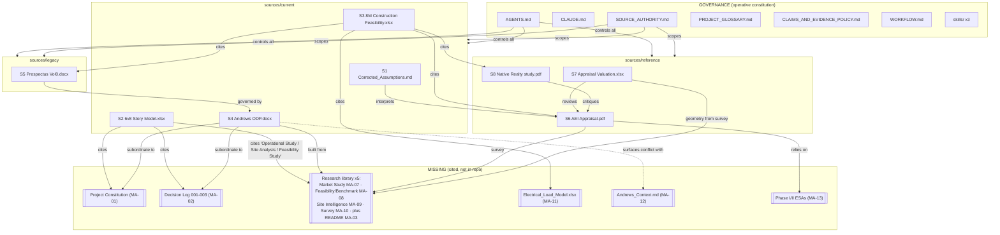
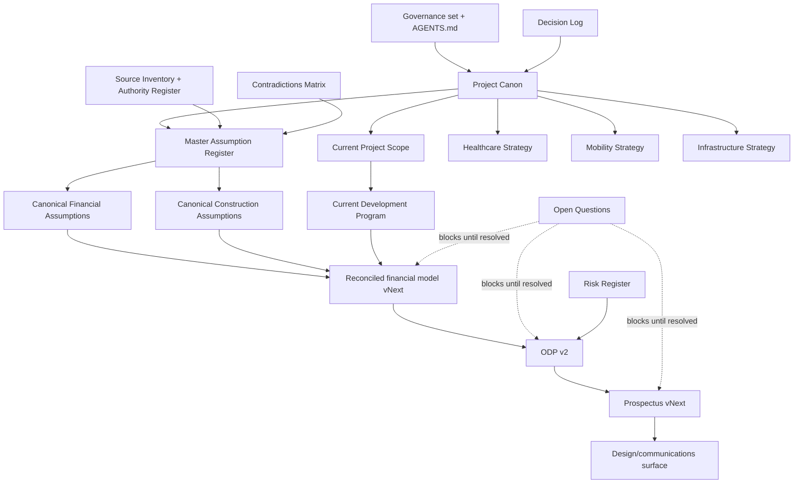

# Document Dependency Graph

**Status:** Current dependency reference · **Last reviewed:** 2026-07-26
**Related:** [Source Inventory](Source%20Inventory.md) · [Document Update Order](Document%20Update%20Order.md) · [Repository Knowledge Graph](Repository%20Knowledge%20Graph.md)

Document-level edges: who cites whom, who depends on whom, and where citations point at documents that do not exist (**MISSING**). This graph determines safe update order: a document may only be revised after everything it depends on is settled.

## 1. As-is graph (today)

**Reading:** three of four current sources ground themselves in documents that are missing (dashed/red zone). Until MA-01/02/07–11 are recovered or formally succeeded, those citations are one-remove evidence at best.

## 2. To-be graph (after this planning set is ratified)

**Rule:** flow is one-way. A downstream document never introduces a value absent upstream; if it needs one, the upstream register changes first (with provenance), then the downstream regenerates.

## 3. Dependency table (who must move when X changes)

| If this changes… | …these must be revisited |
|---|---|
| Owner decision (any D-##) | Project Canon → affected register rows → both models → ODP v2 chain |
| Program basis resolution (OQ-14) | Development Program §1 → all PRG/CST/REV DUAL rows → S2/S3 successor model → everything downstream |
| Rent resolution (OQ-15) | Financial Assumptions → NOI/yield outputs → feasibility statement → partner-gap figures |
| Tax counsel opinion (OQ-17) | Financial Assumptions §4 → solar/BESS net costs → TDC → yield gap |
| FPL study (OQ-04) | Infrastructure Strategy §1 → utility cost line → imaging gate → DCFC gate |
| Zoning Verification Letter (OQ-03) | Canon §4 → Scope scenario table → height decision inputs |
| Recovery of any MA-xx document | Source Inventory + Authority Register + every claim currently cited "via missing doc" |
| Appraisal update / new offer terms | Acquisition rows (ACQ-01…09) → negotiation docs |

## 4. Citation hygiene rules

1. Citations to missing documents must be written as "X *as cited by* [present source]" — never as direct citations.
2. When a missing document is recovered, its direct citations replace the one-remove forms in the next update cycle.
3. Every new document declares its dependencies in a header block so this graph can be regenerated mechanically.
