# Repository Knowledge Graph

**Status:** Draft for owner review · **Date:** 2026-07-26 · **Author:** AI planning session
**Related:** [Canonical Data Model](Canonical%20Data%20Model.md) (schema) · [Document Dependency Graph](Document%20Dependency%20Graph.md) (document-level edges)

Concept-level map of the project: every material concept is a node; every dependency, gate, contradiction, or citation is a typed edge. Edge types: `enables` · `gates` (hard prerequisite) · `funds` · `contradicts` · `supersedes` · `cites` · `contextFor` · `converts-to` · `competes-on-roof`.

## 1. Overview diagram

```mermaid
graph TD
  subgraph SITE["SITE & ENTITLEMENT"]
    Site["Site 38,207 SF corner<br/>folio 50-42-15-01-0711"]
    Zoning["RAC-RPO / SRAC"]
    Flood["FEMA Zone AE (BFE ~5 ft)"]
    QOZ["Federal QOZ"]
    Height["Height path >6 stories<br/>Level III review (unverified)"]
    Stormwater["Stormwater / resilience design"]
    Traffic["Traffic study (OQ-05)"]
    ZVL["Zoning Verification Letter (MB-01)"]
    TestFit["Architect test-fit (MB-02)"]
  end

  subgraph HC["HEALTHCARE ANCHOR"]
    BH["Broward Health expansion<br/>188K SF MOB · GME 365 (SD)"]
    Spillover["Spillover demand thesis"]
    MOB["Medical office / clinical space"]
    Cowork["Medical co-working master tenant (prospective)"]
    Medtail["Med-tail ground floor"]
    Imaging["Imaging / diagnostics (gated)"]
  end

  subgraph MOBI["MOBILITY (ENABLING)"]
    Parking["Structured convertible parking"]
    SharedPk["Shared-parking operations (LPR)"]
    EVready["EV conduit to 100% stalls"]
    EVinst["~40 chargers day-one (OQ-21)"]
    DCFC["DCFC expansion (stub-outs)"]
    AVstage["AV staging capability"]
    AVrev["AV staging lease revenue<br/>(base = $0)"]
    Fleets["Waymo / Zoox / Tesla / Freebee<br/>(context only)"]
    Transit["Brightline / BCR South / FLL"]
  end

  subgraph INFRA["ENERGY & DATA"]
    FPL["FPL service & switchgear<br/>(capacity UNVERIFIED)"]
    Solar["Rooftop solar (sizing DUAL)"]
    BESS["Battery storage (peak-shave)"]
    Edge["Edge / fleet data room"]
    Fiber["Tier-1 redundant fiber"]
    Roof["Roof area (finite)"]
    Garden["Staff roof garden"]
  end

  subgraph CAP["CAPITAL & RETURNS"]
    Land8["$8.0M land offer"]
    Appraisal["$11.1M appraisal (opinion)"]
    TDC["Development cost $59–95M<br/>(basis-dependent)"]
    NOI["Base NOI $2.2–3.8M"]
    Gap["YIELD GAP: 3.8–4.1% YoC<br/>vs 6.25–7.0% required"]
    PartnerSup["Health-system anchor / master lease /<br/>grants / capital contribution"]
    QOZeq["QOZ equity, 10-yr hold"]
    Debt["Construction debt 60–65% LTC"]
    Grants["P3 / MPO / TIF (upside only)"]
  end

  Site --> Zoning --> Height
  Site --> Flood --> Stormwater
  Stormwater -->|gates| Height
  ZVL -->|gates| Height
  Traffic -->|gates| AVstage
  TestFit -->|gates| Parking
  Site --> QOZ --> QOZeq

  BH --> Spillover --> MOB
  Spillover --> Medtail
  Cowork -->|enables lease-up| MOB
  FPL -->|gates| Imaging
  Parking -->|enables ratio 4-5/1000| MOB
  Medtail -->|activates frontage| Zoning

  Parking --> SharedPk -->|funds| NOI
  Parking --> EVready --> EVinst -->|~$120K/yr| NOI
  EVready --> DCFC
  FPL -->|gates| DCFC
  Parking -->|converts-to| MOB
  AVstage --> AVrev -.->|only if operator signs| NOI
  Fleets -->|contextFor| AVstage
  Transit -->|contextFor| SharedPk

  Roof --> Solar
  Roof --> Garden
  Roof --> Edge
  Solar ---|competes-on-roof| Garden
  Solar --> BESS
  BESS -->|demand-charge mgmt| DCFC
  Fiber --> Edge

  Land8 --> TDC --> Gap
  Appraisal -.->|contradicts| Land8
  NOI --> Gap
  Gap ==>|requires| PartnerSup
  QOZeq --> TDC
  Debt --> TDC
  Grants -.->|upside only| Gap
```

## 2. Node register (with status)

| Node | Type | Status / class | Key sources |
|---|---|---|---|
| Site (38,207 SF, folio, frontages) | site | verified fact | S6, S8 |
| RAC-RPO / SRAC zoning | entitlement | SD (ZVL pending) | S6, S4, S8 |
| Height path (>6-story review; ~12 ceiling) | entitlement | SD, conflicting reads (OQ-03/11) | S8, S1 vs S4 |
| FEMA AE / stormwater | constraint | verified fact / gating design | S6; ODP |
| QOZ | incentive | SD | S4/S5 |
| Broward Health expansion | demand driver | SD (MB-17) | S5, S4 |
| Spillover thesis | hypothesis | working assumption | S4/S5 |
| Medical office / clinical | program (core) | areas TBD (OQ-14) | S2/S3/S4 |
| Medical co-working anchor | strategy | REC; operator unidentified (OQ-08) | S4 |
| Med-tail | program (core) | strategy adopted | S4 |
| Imaging | program (gated) | gated on FPL (OQ-04) | S4 |
| Structured convertible parking | program (core) | counts DUAL | S2/S3/S4 |
| Shared parking / LPR ops | operations | adopted concept | S4 |
| EV conduit 100% | readiness rule | adopted | S2/S3/S4 |
| ~40 initial chargers | program | split unresolved (OQ-21) | S2 vs S3 |
| DCFC expansion | optionality | demand/FPL-gated | S3 |
| AV staging capability | program (capability) | owner directive; form DUAL | S2/S3 |
| AV staging revenue | optionality revenue | $0 base (OQ-22 flag on S3) | S2/S3 |
| Fleet operators | market context | no partnership assumed | S3 Sources |
| FPL service | infrastructure | **unverified — gates most of the graph** | S3/S4 |
| Solar / BESS | infrastructure | sizing DUAL; $0 credits interim | S2/S3 |
| Edge data room | optionality | scope DUAL | S2/S3 |
| Roof allocation | design tension | unresolved (drives solar DUAL) | S2 vs S3 |
| $8.0M offer | capital | owner directive (D-P1 pending) | S2/S3/S8 |
| $11.1M appraisal | capital context | appraisal opinion + critiques | S6; S1/S8 |
| Yield gap | model output | **canonical convergent finding** | S2+S3 |
| Partner support / grants | capital strategy | required to close gap; all prospective | S3/S4 |

## 3. Highest-degree nodes (what the graph says matters most)

1. **FPL capacity** — gates imaging, DCFC, AV/edge loads, MEP design, and two cost lines. Single most connected unverified node.
2. **Program basis / test-fit** — gates parking counts, GBA, RSF, every $/SF-derived total, and both scenarios.
3. **Yield gap → partner support** — the only edge that turns the project from "does not pencil" to "pencils"; connects healthcare strategy, mobility optionality, and capital stack.
4. **Stormwater/Zone AE** — gates entitlement itself.
5. **Zoning verification** — gates height, parking method, and the entire massing envelope.

## 4. Contradiction edges (live)

`$11.1M appraisal ↔ $8.0M offer` · `35k plate ↔ 28k/24k plates` · `$36 ↔ $50 rent` · `30% ITC ↔ 0%` · `6.25% ↔ 7.25% exit cap` · `32L2+8DCFC ↔ 40L2+stubs` · `AV $0 base ↔ S3 $194K in base` · `110 ft by-right ↔ Level III review` — all tracked in the [Contradictions Matrix](Contradictions%20Matrix.md); none may be silently collapsed.

## 5. Maintenance

Add a node when a new concept gains a source or a dollar; add a `gates` edge whenever a study/report blocks a decision; re-render §1 after each owner decision batch. The mermaid diagram renders natively in the repo's tooling.
